# AI Productivity Analysis: Alkemy Project

**Group SEA · Machine Learning Project · A.Y. 2025/2026 · LUISS**

Simone Cavallaro - 815441, Andrea Mammano - 821311, Elisa Presciutti - 812891

---

## 1. Introduction

This project analyzes how AI affects business workflows, focusing on whether efficiency gains actually translate into profit. The question is not whether AI speeds things up (it does), but whether that speed shows up on the bottom line. The answer, it turns out, depends almost entirely on how the work is billed.

### 1.1 Repository Structure
The project is organized to ensure clarity, reproducibility, and a clear separation between data processing, feature engineering, and analysis.

|── images/               # Figures generated by main.ipynb                                                 
├── .gitignore                                                  
├── .python-version                                                                 
├── README.md             # Project documentation                                                           
├── main.ipynb            # Main analysis notebook                                                                  
├── pyproject.toml        # Project metadata and dependencies                                                           
├── requirements.txt      # Python dependencies (pip fallback)                                                                          
└── uv.lock               # Locked dependency versions                                                                                          
> **Note:** The `data/` folder is not tracked by git. Place the raw dataset at `data/ai_productivity_dataset_final.csv` before running the notebook.

All figures in `images/` are generated by `main.ipynb` and do not need to be created manually. Running the notebook end-to-end will reproduce every plot.

### 1.2 Environment and Reproducibility

The Python version is pinned in `.python-version`. Dependencies are locked in `uv.lock`.

**With uv (recommended):**
```bash
pip install uv
uv sync
uv run jupyter notebook main.ipynb
```

**With pip:**
```bash
pip install -r requirements.txt
jupyter notebook main.ipynb
```
---

## 2. Methods

### 2.1 Data Understanding

The dataset contains 3,248 observations and 34 variables. Each row is one task inside a business workflow.

| Variable Category | Examples | Description |
|------------------|---------|------------|
| Numerical | hours_spent, revenue, profit | Continuous operational and financial measures |
| Categorical | team, task_type, client | Task and organizational attributes |
| Boolean | ai_assisted, sla_breach, scope_change_flag, legacy_ai_flag | Binary process indicators |

> **Note:** `scope_change_flag`, `sla_breach`, and `legacy_ai_flag` are semantically boolean but are stored as integer or string dtype at load time. They are manually reclassified for display purposes; dtype conversion happens in the cleaning phase.

The dataset captures four dimensions: operational efficiency (time and workload), AI adoption (presence and intensity), quality and process performance (errors, revisions, rework), and economic outcomes (profitability).

The financial variables are right-skewed, average profit sits around 349, but the range spans from losses near −8,510 to gains near 14,000. A handful of extreme cases drive most of the variance, not the typical task. `hours_spent` and `rework_hours` follow the same pattern. `ai_usage_pct` runs from 0% to 93% with an average around 36%, meaning AI is not uniformly adopted and its intensity varies enough to test non-linear and threshold effects rather than a simple binary split.

From a data quality perspective, several variables have missing values: `ai_usage_pct`, `rework_hours`, `billable_hours`, and `outcome_score` among them. These gaps are not purely technical; they likely reflect incomplete tracking or process inconsistencies in the operational system. The engineered feature `duration_days` (derived from `created_at` and `delivered_at`) is introduced in the cleaning phase and described further in Section 2.2.

### 2.2 Data Preparation

Cleaning focused on consistency and reliability without erasing structural patterns that matter for the research question.

**Deduplication.** No full-row duplicates were found, but 48 task_id entries appeared more than once. Tasks were sorted by `updated_at` and only the most recent record kept, so the analysis always reflects the latest state of each task.

**Category normalization.** Both `team` and `task_type` had casing inconsistencies, formatting variants, and typos. String cleaning and explicit mapping rules consolidated them into four balanced team categories (Content, Media, Design, SEO) and seven task types (Ad, Article, Design, Development, Release, Report, Ticket). Three additional types (Social Post, Landing Page, Email Campaign) were defined in the mapping dictionary but represent negligible or absent cases in the cleaned data.

**Date parsing.** `created_at` and `delivered_at` were parsed to datetime, and a `duration_days` feature was computed as the difference. Fourteen negative durations, almost certainly data entry errors, were set to NaN rather than corrected. The resulting feature spans 0 to 10 days with a mean of 4.5 days.

**`legacy_ai_flag` standardization.** This column had mixed casing and an "unknown" category. Values were mapped to 1/0 (True/False), and "unknown" was set to NaN rather than forced into either category.

**AI adoption indicator.** A binary feature `ai_flag` was created based on whether `ai_usage_pct` is greater than zero. A correlation check between `ai_flag` and `legacy_ai_flag` returned −0.014, essentially no relationship. Tasks historically labeled as AI-assisted do not align with measurable current usage. This finding makes the quantitative `ai_usage_pct` the more reliable signal throughout the analysis.

### 2.3 Missing Values and Outlier Treatment

The initial missing value check showed `legacy_ai_flag` (~10.5%) and `jira_ticket` (~10.3%) with the most gaps, followed by `ai_usage_pct` and `outcome_score`. A missingness matrix confirmed no systematic monotone patterns.

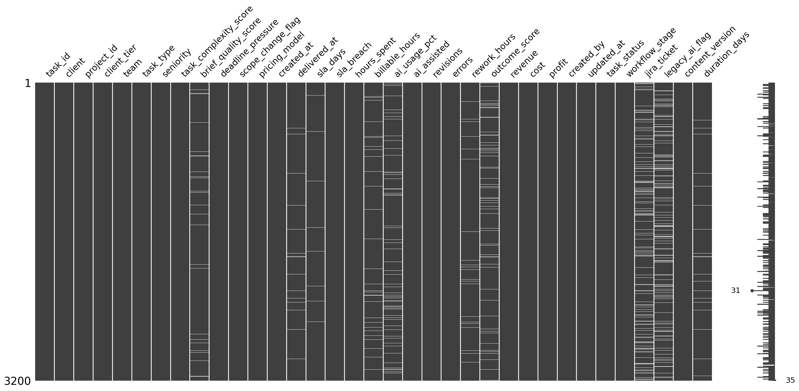

The distributions of key variables for rows where `ai_usage_pct` is missing were compared against the full dataset.

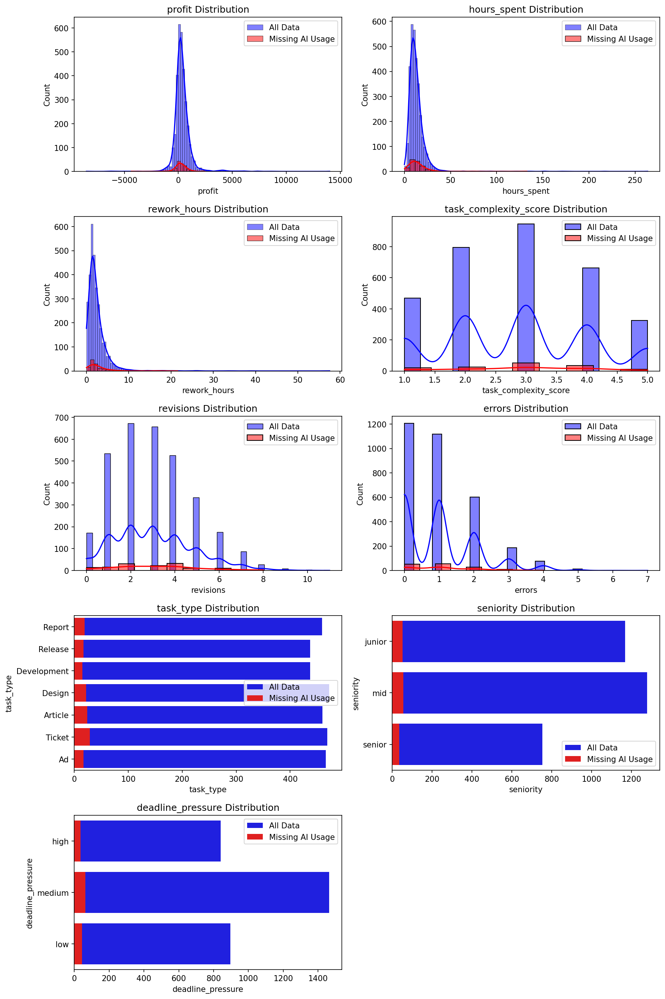

The missing rows look statistically similar to the rest of the data. Imputation is therefore unlikely to introduce structural bias.

`jira_ticket` was dropped entirely: it is a pure identifier and adds nothing analytically. Continuous variables (`ai_usage_pct`, `outcome_score`, `brief_quality_score`, `sla_days`, `rework_hours`) were filled with their medians, which are robust to the skewed distributions in this dataset. For `billable_hours`, missing values were filled as 85% of `hours_spent`, reflecting a realistic effective billing rate rather than a purely statistical imputation. Negative `billable_hours` values were first set to NaN before this heuristic was applied, so the imputation did not propagate any recording errors.

`scope_change_flag` and `sla_breach` were converted to boolean to prevent them from appearing as continuous features in downstream analyses. Residual NaN values in `delivered_at` and `legacy_ai_flag` were left as-is. Forcing imputation there would introduce artificial certainty into fields that are genuinely uncertain.

No outlier capping was applied. Extremely high `hours_spent` values are real complex tasks. Large `revenue` values are large contracts. High `rework_hours` captures the severe quality failures that are actually most relevant to the research question. Removing them would bias the analysis toward the easy cases.

Instead, robustness was handled through method choice. Both Pearson and Spearman correlations were computed: Pearson for linear relationships, Spearman because it is rank-based and therefore not distorted by the extreme values retained in the dataset.

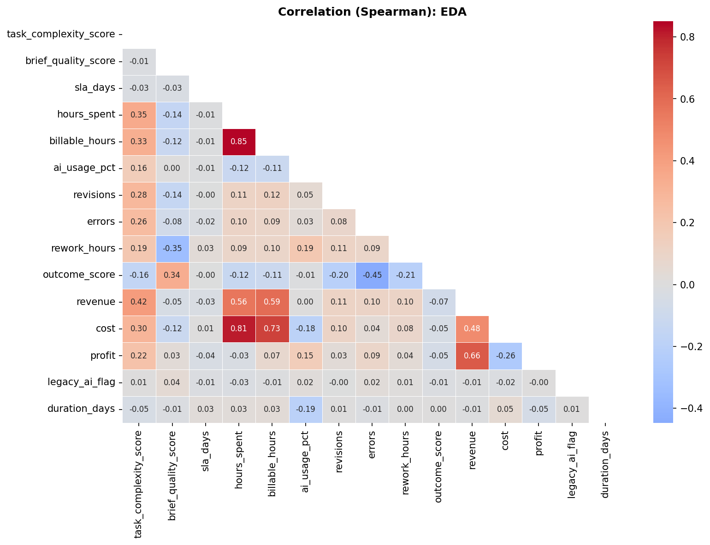

The Spearman heatmap confirms expected structural relationships: cost driven by hours_spent, revenue scaling with profit, errors negatively associated with outcome_score. `ai_usage_pct` shows weak correlations with profit (ρ = 0.15) and quality variables. This is not evidence of irrelevance; it reflects that AI's effect is not monotonically linear, which motivates the threshold analysis in later sections.

### 2.4 Feature Engineering

The feature engineering phase converts the cleaned dataset into variables that directly address the research question. All original variables are preserved unchanged. The new features normalize, contextualize, or decompose the existing ones.

A first group focuses on profitability normalization. `profit_margin` expresses profit as a share of revenue, making tasks of different sizes directly comparable.

A second group captures efficiency and quality dynamics. `rework_rate` and `error_rate` measure inefficiency relative to time invested. `billable_ratio` shows how much of the effort is actually monetized. `revenue_per_hour` and `cost_per_hour` translate activity into economic productivity metrics.

Rework gets special treatment. `rework_hours` is converted into a monetary estimate (`rework_cost_est`) using the median cost per hour, and `hidden_cost_ratio` expresses this as a share of total cost. This makes the cost of inefficiency visible at the economic level rather than the operational one.

A third group structures AI adoption. `ai_flag` gives a binary baseline (AI used vs. not used). `ai_usage_sq` adds a quadratic term for non-linear effects. `ai_bucket` segments tasks into five 20-percentage-point intensity tiers (0–20% up to 80–100%), which is the primary grouping variable for threshold analysis. `is_high_ai` flags tasks at or above 60% intensity for direct comparison between shallow and deep adoption.

Segmentation variables, `budget_bucket` (revenue split at the median), `complexity_bucket` (tertiles of `task_complexity_score`), allow testing whether AI's effect is uniform or concentrated in specific contexts.

All ratio-based features use a stabilized denominator. `hours_spent` is clipped to a minimum of 0.1 hours before any division to prevent artificially extreme values from a small number of logging errors.

| Feature | Definition | Purpose |
|--------|-----------|--------|
| profit_margin | profit / revenue × 100 | Normalize profitability across task sizes |
| ai_flag | ai_usage_pct > 0 | Binary AI usage indicator |
| rework_rate | rework_hours / hours_spent | Operational inefficiency ratio |
| error_rate | errors / hours_spent | Quality issues relative to effort |
| billable_ratio | billable_hours / hours_spent | Monetization efficiency |
| revenue_per_hour | revenue / hours_spent | Productivity per hour worked |
| cost_per_hour | cost / hours_spent | Cost intensity per hour |
| rework_cost_est | rework_hours × median cost/hour | Monetary value of rework |
| hidden_cost_ratio | rework_cost_est / cost | Share of total cost absorbed by rework |
| ai_usage_sq | (ai_usage_pct)² | Non-linear AI adoption effect |
| ai_bucket | categorical bins of ai_usage_pct | Threshold segmentation |
| is_high_ai | ai_usage_pct ≥ 0.60 | Isolate high-intensity AI tasks |
| complexity_bucket | tertiles of task_complexity_score | Complexity segmentation |
| budget_bucket | median split of revenue | Economic scale segmentation |

> **Note on `ai_bucket`:** The 0–20% tier includes tasks with exactly 0% AI usage alongside those with 1–20% usage. This conflation of "no AI" with "low AI" affects interpretation of the lowest bucket. The binary `ai_flag` analysis in Section 3 addresses the zero-usage group separately.

---

## 3. Experimental Design

### 3.1 Setup and Data Preparation

The target variable is `profit_margin`: profit divided by revenue, expressed as a percentage. This normalization prevents larger contracts from dominating the analysis.

The modeling strategy runs in two parallel configurations. The first trains on the original feature space. The second applies `log1p` to right-skewed numerical variables before running the same pipeline. The design isolates the effect of distributional correction on linear models while using Random Forest as a control, since tree-based models are invariant to monotonic transformations.

Binary process variables (`sla_breach`, `scope_change_flag`, `ai_assisted`) are converted to 0/1 integers so they can be treated as numeric inputs directly, without separate encoding.

Before modeling, variables that cannot legitimately enter the feature space are removed:

- **Leakage** (algebraically derived from the target): `profit`, `revenue`, `cost`, `revenue_per_hour`, `cost_per_hour`, `profit_bucket`, `budget_bucket`, `hidden_cost_ratio`, `rework_cost_est`, and all binned versions of these.
- **Identifiers** (no signal by construction): `task_id`, `project_id`, `client`, `created_by`.
- **Raw timestamps** (informational content already captured by `duration_days`): `created_at`, `delivered_at`, `updated_at`.
- **Post-hoc flags** (unavailable at prediction time): `task_status`, `workflow_stage`.

After this filtering, 30 candidate features remain: 21 numerical and 9 categorical. These expand to 57 encoded variables after one-hot encoding of the categorical predictors. Lasso operates on this encoded space of 57 inputs, not the 30 pre-encoding features.

### Feature Overview

| Feature | Numeric | Categorical |
|--------|--------|------------|
| task_complexity_score | X | |
| brief_quality_score | X | |
| scope_change_flag | X | |
| sla_days | X | |
| sla_breach | X | |
| hours_spent | X | |
| billable_hours | X | |
| ai_usage_pct | X | |
| ai_assisted | X | |
| revisions | X | |
| errors | X | |
| rework_hours | X | |
| outcome_score | X | |
| legacy_ai_flag | X | |
| duration_days | X | |
| ai_flag | X | |
| rework_rate | X | |
| error_rate | X | |
| billable_ratio | X | |
| ai_usage_sq | X | |
| is_high_ai | X | |
| client_tier | | X |
| team | | X |
| task_type | | X |
| seniority | | X |
| deadline_pressure | | X |
| pricing_model | | X |
| content_version | | X |
| ai_bucket | | X |
| complexity_bucket | | X |

The preprocessing pipeline is identical across all models and both experimental configurations. Numerical variables are imputed with the median and then standardized. Categorical variables get most-frequent imputation followed by one-hot encoding with `handle_unknown='ignore'`. The dataset is split 80/20 into training and test sets using a fixed random seed.

### Train/Test Split

| Set   | Rows | Share |
|-------|------|-------|
| Train | 2,560 | 80%  |
| Test  | 640   | 20%  |

Performance is measured with four metrics. R² gives the proportion of variance explained. MAE gives average prediction error in percentage points. RMSE penalizes larger errors more heavily. Cross-validated R² on the training set provides a more conservative generalization estimate.

---

### 3.2 Lasso Feature Selection

With 57 encoded variables in the candidate space, some redundancy is expected. Lasso regression handles this through L1 regularization, which forces less relevant coefficients to exactly zero. The regularization strength is chosen by LassoCV with 5-fold cross-validation, minimizing held-out MSE. Lasso is used here only as a selector, it is not included in the final model comparison.

The results show 32 features retained out of 57 encoded variables, with the remaining 25 shrunk to zero.

#### Lasso Selection

| Metric | Value |
|--------|------|
| Best alpha (LassoCV) | 0.5697 |
| Features retained | 32 / 57 |
| Features zeroed out | 25 / 57 |

The retained coefficients show a clear economic structure. The strongest positive associations are `seniority_junior` and `pricing_model_value_based`, indicating that lower-cost resources and contracts that decouple revenue from time both contribute to higher margins. `task_complexity_score` and `ai_bucket_40-60%` also show positive coefficients. On the negative side, `pricing_model_hourly` and `seniority_senior` dominate: hourly billing compresses margins mechanically because AI efficiency reduces billable hours, and senior roles carry higher costs that are not always offset by higher billing rates.

`ai_usage_pct` itself is zeroed out by Lasso, which is expected. Its relationship with margin is non-linear and therefore invisible to L1 regularization operating under a linear-additive assumption. The SHAP analysis in Section 4.2 captures this non-linear contribution.

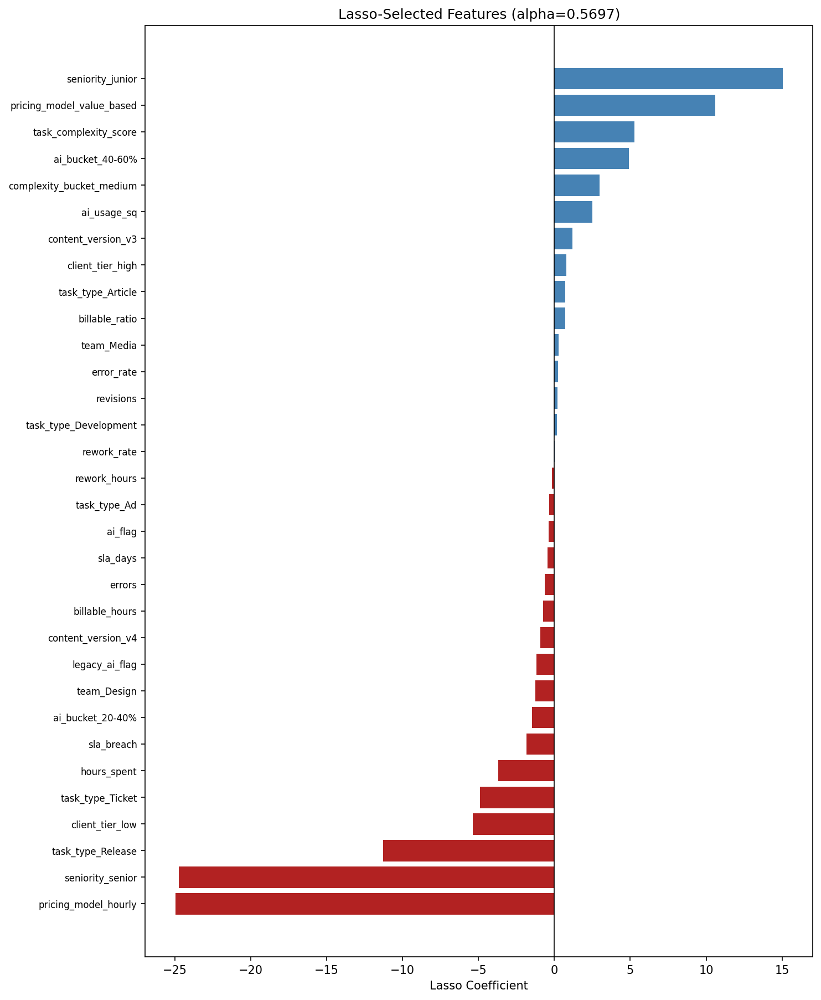

---

### 3.3 Linear Regression on Selected Features

After Lasso selects the feature subset, the retained encoded variables are mapped back to their original column names. Linear Regression is then fitted on this reduced set using the same preprocessing pipeline, giving each coefficient a direct marginal interpretation.

### Model Performance

| Metric | Value |
|--------|------|
| Test R² | 0.2048 |
| Test MAE (pp) | 32.06 |
| Test RMSE (pp) | 48.55 |
| 5-fold CV R² | 0.0832 |

The model explains about 20% of profit margin variance. The gap between test R² (0.2048) and CV R² (0.0832) reflects genuine complexity in the system: profitability depends on multiple interacting factors that a linear model partially misses. That said, the coefficients tell a consistent story.

### Coefficient Analysis

The strongest positive effects come from `seniority_junior` and `pricing_model_value_based`. `ai_bucket_40-60%` and `ai_usage_sq` also appear among the top positive coefficients, consistent with moderate-to-deep AI adoption contributing positively to margin. On the negative side, `seniority_senior` and `pricing_model_hourly` are the largest coefficients. `hours_spent` is negative (longer tasks compress margins). `ai_bucket_80-100%` also shows a negative coefficient in this linear model, but this should not be read as evidence that very high AI usage harms margins. In a multivariate OLS setting, this coefficient is estimated while controlling for pricing model, seniority, and hours (factors that are themselves correlated with high AI adoption). The non-linear structure of the AI-margin relationship, visible in the EDA and confirmed by SHAP, cannot be recovered by a linear estimator regardless of feature set.

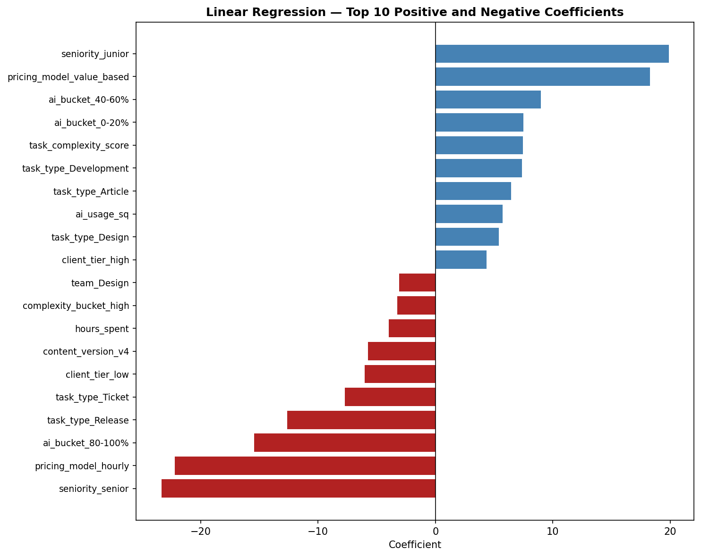

---

### 3.4 Random Forest with Hyperparameter Tuning

Random Forest is trained on the full 30-candidate feature set rather than the Lasso-reduced subset, allowing it to capture interactions and non-linearities that Lasso penalizes to zero. Hyperparameters are selected via grid search with 5-fold cross-validation over number of trees (100, 200, 300), maximum depth (4, 6, 8, or unconstrained), and minimum leaf size (10, 20, 40). The optimal configuration uses 300 trees, unconstrained depth, and a minimum leaf size of 10.

| Metric | Linear Regression | Random Forest |
|--------|------------------|--------------:|
| Test R² | 0.2048 | 0.3445 |
| Test MAE (pp) | 32.06 | 27.64 |
| Test RMSE (pp) | 48.55 | 44.08 |
| 5-fold CV R² | 0.0832 | 0.1844 |

The R² gain of roughly 0.14 confirms that a substantial portion of variance is explained by non-linear patterns and interactions that OLS cannot capture. Part of the remaining unexplained variance reflects factors outside the dataset (client pricing power, negotiation dynamics, individual skill differences) that are not directly measurable. The modeling results identify systematic patterns; they do not give complete predictive control over outcomes.

Feature-level interpretation of the Random Forest is provided through SHAP analysis in Section 4.2.

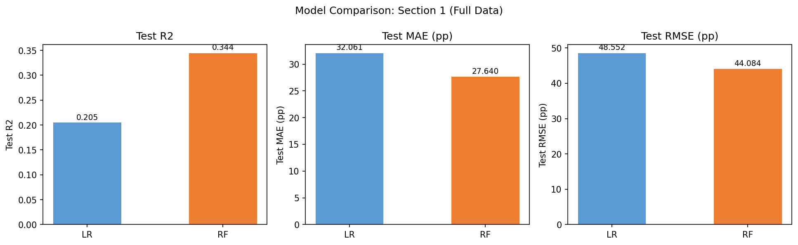

---

## 4. Results

Three findings hold across all analyses. AI usage intensity is positively associated with profit margin, but only above moderate adoption levels. The pricing model is the primary structural driver of profitability and moderates the AI effect. A substantial portion of the predictive signal is non-linear, as shown by the gap between Linear Regression and Random Forest performance.

### 4.1 Segmented Analysis

Margins rise with AI intensity overall, but this aggregate pattern conceals real structural differences across teams, task types, and contracts. AI does not operate in a vacuum. Its economic impact depends on how the work is organized, what kind of task it is, and how it gets billed.

**Team level.** Content, Design, and Media all show a broadly monotonic increase in profit margin as AI usage rises. Content moves from 18.7% at the 0–20% bucket to 50.6% at 80–100%. Design goes from 18.6% to 49.2%, Media from 21.4% to 51.9%. SEO breaks the pattern: margins climb to 41.5% at 60–80% then drop sharply to 25.0% at 80–100%. This is the only team where higher AI intensity leads to worse outcomes, suggesting that beyond a certain adoption level, integration quality starts to matter more than intensity alone. Importantly, the reliability heatmap shows only 6 tasks in the SEO × 80–100% cell. This reversal should not be treated as a confirmed finding. It is a hypothesis that needs more data before it can be acted on.

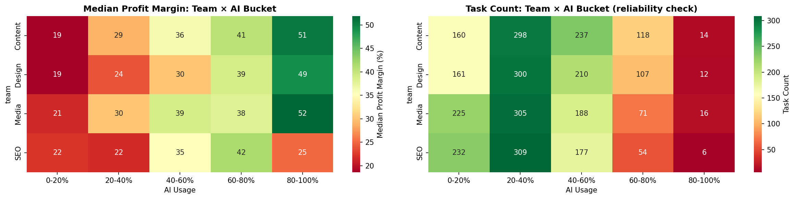

**Task type.** Development shows the clearest AI-margin relationship, rising from 19.8% to 70.8% (the highest single cell in the entire task type heatmap). Design (22.2% → 56.9%) and Report (19.3% → 60.2%) follow a similarly clean upward trajectory. These are structured, output-defined tasks where AI generation speed has a direct cost impact without degrading deliverable quality.

Ad, Release, Article, and Ticket tasks are more volatile. Ad peaks at 41.2% in the 60–80% bucket then falls back to 25.2%. Release reaches 50.5% before dropping to 39.6%. Ticket is erratic: 11.3% at low adoption, a dip to 21.4% at 60–80%, then a jump to 58.7% at maximum intensity. The count heatmap shows only 3–11 tasks per type in the 80–100% bucket, so the terminal values, highs and lows alike, carry too much estimation uncertainty to drive decisions.

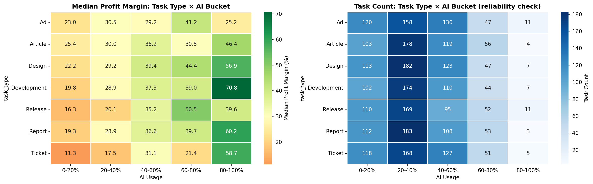

**Pricing model.** This is where the structural divide is sharpest. Hourly contracts account for the majority of tasks (48.2%), followed by fixed-price (37.6%) and value-based (14.2%).

Value-based margins increase steadily from 38.6% to 68.1% across the five buckets. Fixed-price shows an even steeper climb, from 23.2% to 70.2%. At maximum AI intensity the two lines converge: when revenue is locked in advance or decoupled from hours, AI's productivity gains flow directly to the firm.

Hourly contracts behave differently. Margins rise from 13.3% to a peak of 26.3% at 60–80%, then fall to 19.5% at 80–100%. It is the only pricing model where the highest AI tier produces a lower margin than the tier below it. The mechanism is not complicated: when revenue depends on billable hours, faster execution means fewer billable hours, which means less revenue. The productivity gain transfers to the client rather than staying with the business.

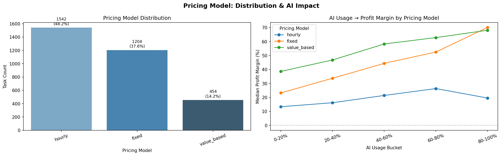

The aggregate finding that AI improves margins holds only when the task is structured enough to benefit from automation, the team integrates AI effectively, and the pricing model lets the firm retain efficiency gains. When any of these conditions fails, the effect weakens or reverses. The combination of high AI usage and hourly billing is the most consistent case of the effect reversing in the data.

---

### 4.2 SHAP Analysis

SHAP (SHapley Additive exPlanations) decomposes each prediction into individual feature contributions, capturing both linear effects and complex interactions learned by the Random Forest.

The beeswarm plot ranks the top 15 features by mean absolute SHAP value. Each point is one observation; color shows the feature value (red = high, blue = low).

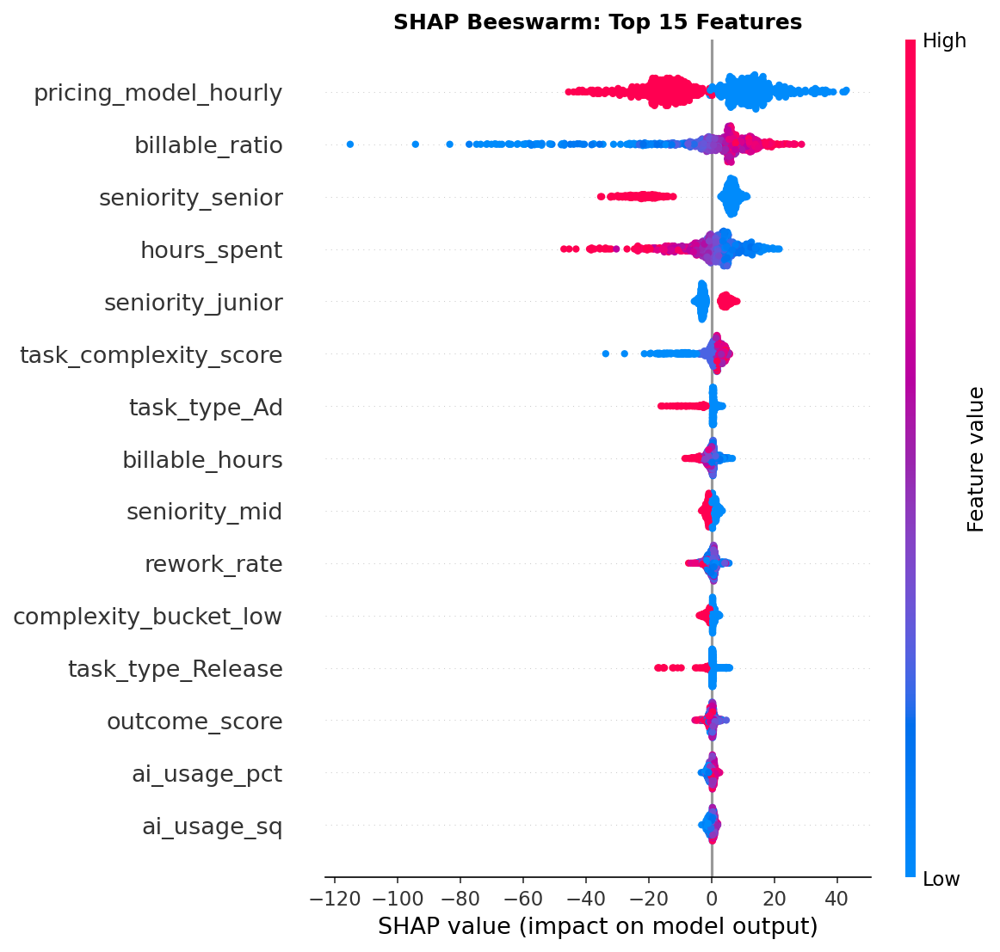

`pricing_model_hourly` is the dominant driver. High values of this feature are consistently associated with negative SHAP values. Hourly billing systematically compresses margins. `billable_ratio` comes second, with a strong positive association: more billable hours relative to total hours means higher margins. Seniority follows: senior workers push margin down (higher costs, not always offset by billing rates), junior workers push it up.

`hours_spent` has a strong negative contribution. Longer tasks compress margins. `ai_usage_pct` ranks 14th out of 57 features, with a mean absolute SHAP of 0.70. Its direct contribution is modest relative to the structural factors, but the dependence plot shows why this framing is incomplete.

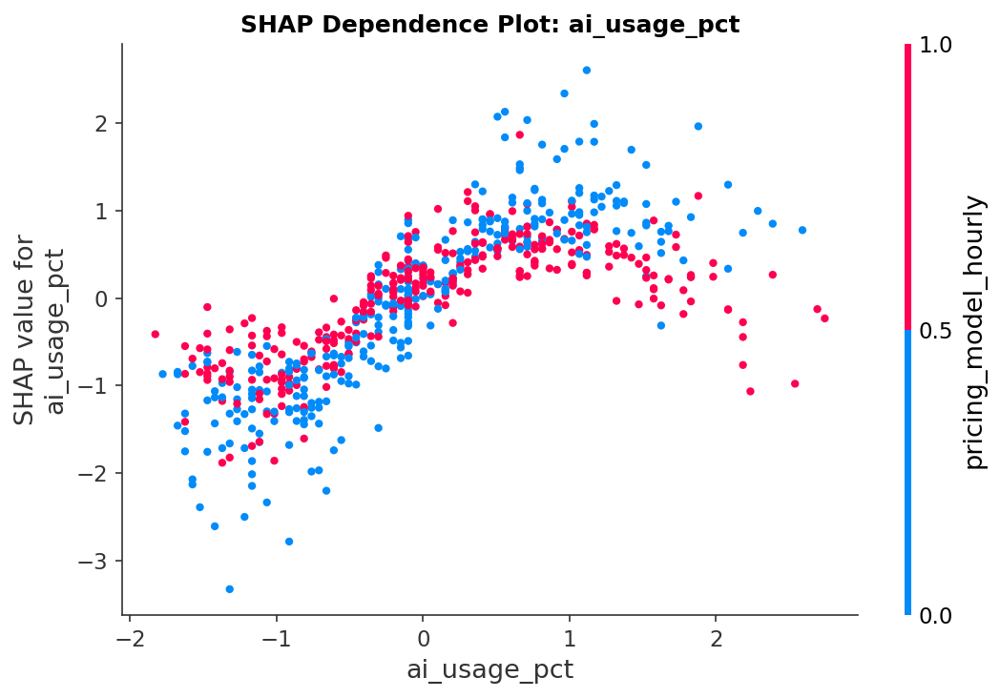

SHAP values for `ai_usage_pct` rise steadily as adoption intensity increases, moving from negative contributions at low levels to positive ones at high levels. This confirms the threshold pattern from the EDA. The interaction coloring adds another layer: red (= hourly billing) observations cluster lower in the SHAP values than blue (= non-hourly) observations at the same AI intensity. The same level of AI adoption generates more margin improvement under fixed or value-based contracts than under hourly ones.

A cross-check between SHAP and Lasso results confirms the robustness of these findings. 11 of the top 15 SHAP features were also retained by Lasso, showing strong agreement between linear and non-linear methods on the main drivers. The four features in the SHAP top 15 but zeroed by Lasso, including `ai_usage_pct` itself, contribute through interaction effects and non-linear patterns that L1 regularization cannot detect.

**SHAP Analysis: Random Forest (Log-transformed)**

SHAP values were also computed on the Random Forest fitted on `log1p`-transformed data. Because Random Forest is invariant to monotonic transformations, the feature importance ranking should be identical to Section 1; any deviation would indicate that the original results were partially artifacts of feature scale.

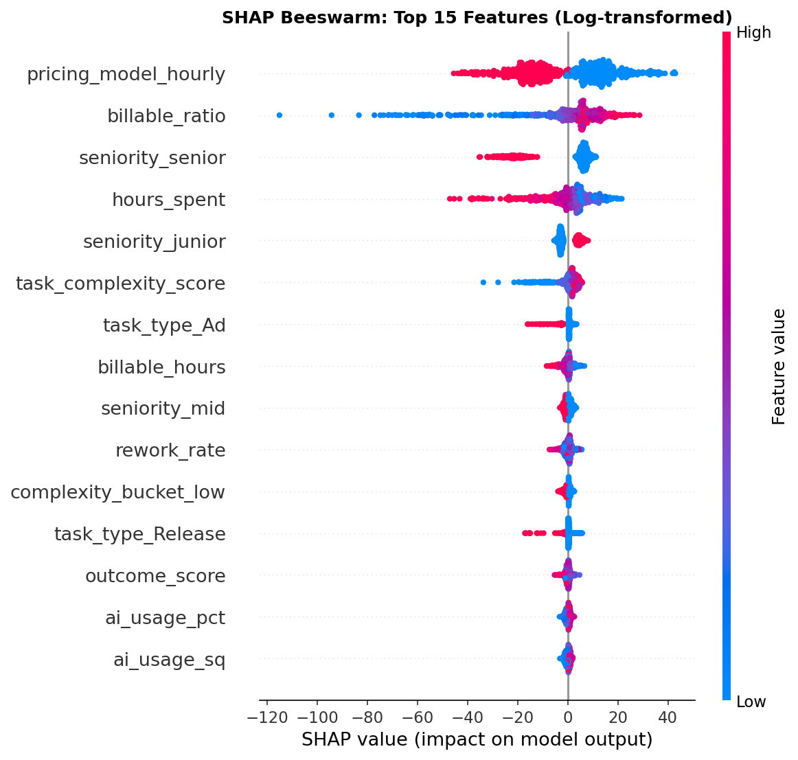

The ranking is completely stable: same 15 features, same order, mean |SHAP| values matching to four decimal places. `pricing_model_hourly`, `billable_ratio`, and `seniority_senior` remain the top three predictors.

| Rank | Feature | Mean \|SHAP\| |
|------|--------|--------------|
| 1 | pricing_model_hourly | 15.23 |
| 2 | billable_ratio | 12.49 |
| 3 | seniority_senior | 10.15 |
| 4 | hours_spent | 7.20 |
| 5 | seniority_junior | 3.60 |
| 6 | task_complexity_score | 3.12 |
| 7 | task_type_Ad | 1.40 |
| 8 | billable_hours | 1.31 |
| 9 | seniority_mid | 1.13 |
| 10 | rework_rate | 1.09 |
| 11 | complexity_bucket_low | 0.94 |
| 12 | task_type_Release | 0.93 |
| 13 | outcome_score | 0.71 |
| 14 | ai_usage_pct | 0.70 |
| 15 | ai_usage_sq | 0.68 |

`ai_usage_pct` holds rank 14, confirming that AI has a real but conditional effect. It matters, but less than pricing structure and seniority composition.

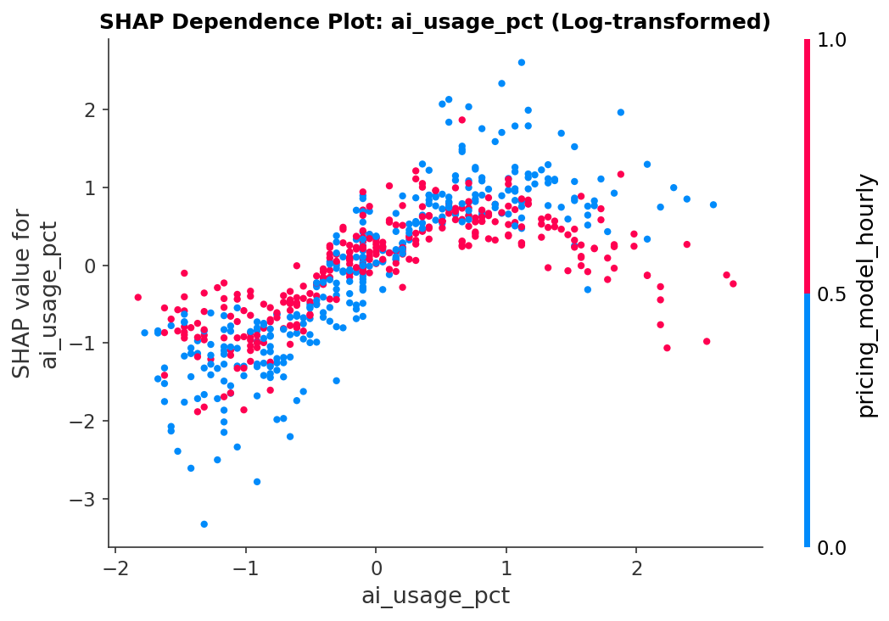

The dependence plot for the log-transformed model is visually identical to Section 1. SHAP values still rise with AI intensity, and the hourly/non-hourly split is preserved. The stability of both plots across both sections rules out feature scale as a confound in the Section 1 SHAP interpretation.

---

### 4.3 Results and Robustness Check

The comparison between base and log-transformed configurations isolates the effect of distributional correction from any other change.

| Dataset | Model | Test R² | Test MAE (pp) | Test RMSE (pp) |
|--------|------|--------|----------------|----------------|
| Base | Linear Regression | 0.2048 | 32.06 | 48.55 |
| Base | Random Forest | 0.3445 | 27.64 | 44.08 |
| Log-transformed | Linear Regression | 0.2487 | 30.65 | 47.19 |
| Log-transformed | Random Forest | 0.3445 | 27.64 | 44.08 |

| Model | Δ R² (Log − Base) | Δ MAE (pp) |
|------|------------------|------------|
| Linear Regression | +0.0439 | −1.41 |
| Random Forest | 0.0000 | +0.00 |

The log transform improves Linear Regression test R² from 0.2048 to 0.2487 and reduces MAE by 1.41 pp. Right-skewed distributions in `hours_spent`, `rework_hours`, `revenue`, and `cost` were pulling the least-squares solution away from the true linear signal. Compressing those tails partially restores it.

Random Forest shows no change. Test R² remains exactly 0.3445, MAE and RMSE unchanged to two decimal places. This confirms the theoretical invariance property of tree-based models: `log1p` is monotonic, so it preserves all rank orderings and the forest finds identical splits. The zero delta is not incidental; it validates that the experimental design is internally consistent and that no data leakage or transformation artifact was introduced.

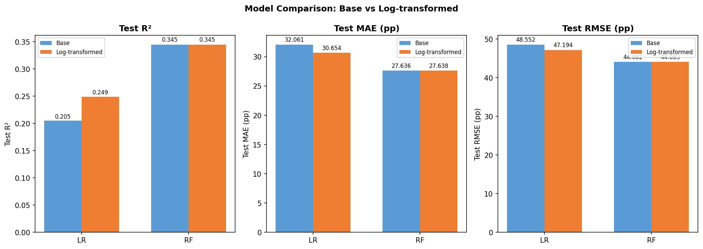

The log-transform comparison also works as a diagnostic for the Section 1 results. The gap between LR (0.2487) and RF (0.3445) after the transform shows that non-linear interactions remain after correcting for skewness: the underlying relationship is genuinely non-linear, not merely obscured by distributional issues.

Below is the visual confirmation that `log1p` achieves its intended effect on the seven transformed features, substantially reducing skewness in `hours_spent` (9.95 → 0.03), `rework_hours` (7.76 → 0.44), and `revenue` (4.72 → −0.20):

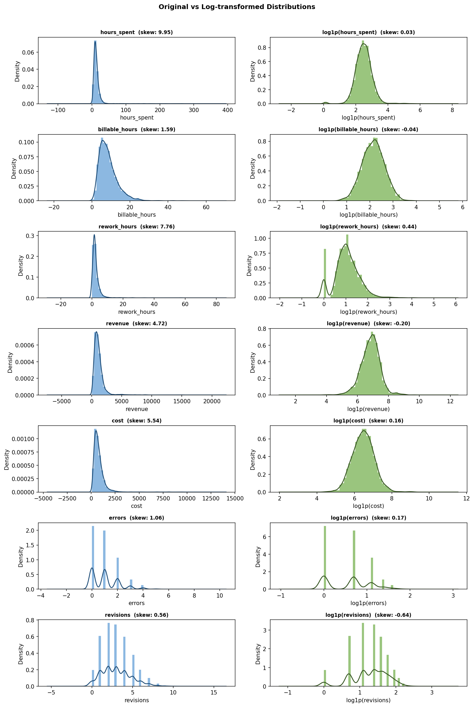

For completeness, the Lasso and Linear Regression coefficient plots for the log-transformed configuration are shown below. The coefficient directions are consistent with Section 1, confirming that the same structural relationships hold after distributional correction.

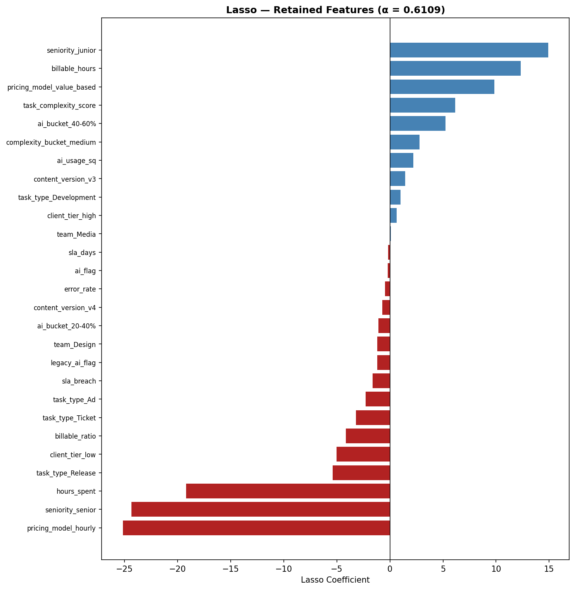

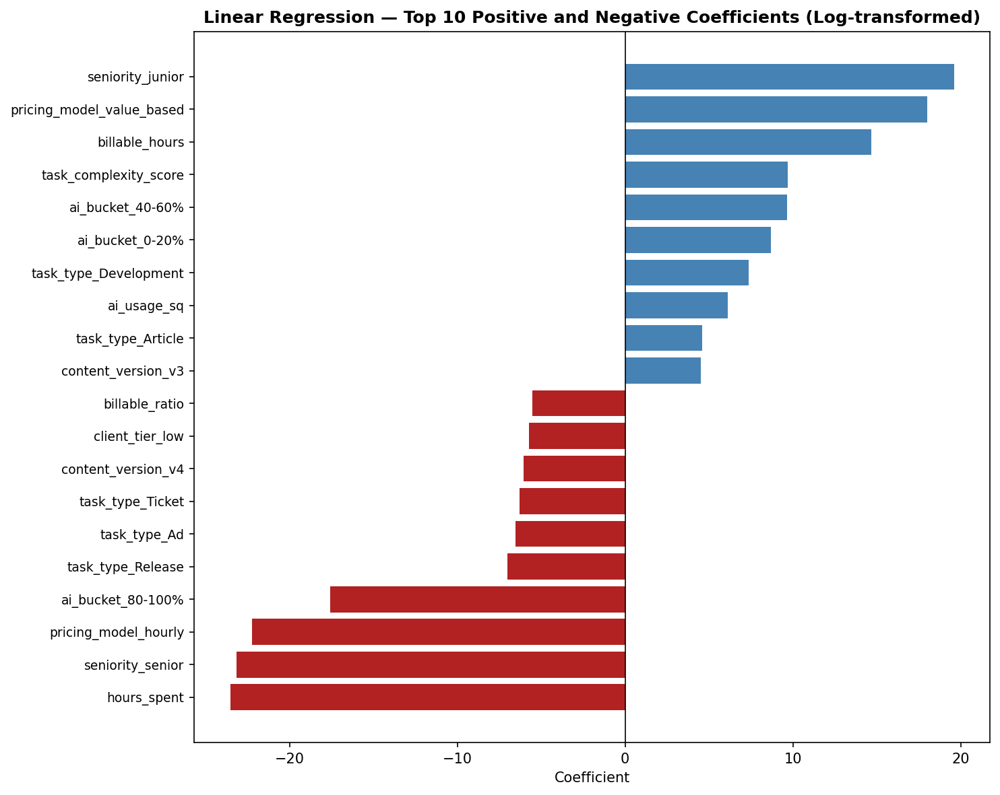

---

## 5. Conclusions

The data gives a consistent answer to the research question: AI does not act as a binary on/off switch for profitability. Its effect is continuous, non-linear, and conditional. Low or moderate adoption (below roughly 40% intensity) produces no measurable economic impact. Above that level, margins rise systematically. But the direction and magnitude of this rise depend almost entirely on the pricing model.

Under fixed-price and value-based contracts, AI efficiency gains translate directly into higher margins. Under hourly billing, the same gains reduce billable hours and revenue, leaving margins flat or slightly worse at the highest AI intensities. Nearly half the dataset (48.2%) runs on hourly contracts. That is the structural constraint.

The modeling results confirm this is not noise. Linear Regression improves after correcting for skewness, meaning distributional issues were partially masking the signal. Random Forest is unchanged by the same transformation, validating the experimental setup. The persistent gap between the two models after log-transformation shows that non-linear interactions are real features of the data, not artifacts of scale.

A large share of variance remains unexplained, probably reflecting client-specific pricing power, individual worker skill, and negotiation dynamics that the dataset does not capture. The results are also observational. Higher AI usage is associated with higher margins, but the direction of causality cannot be fully isolated. More capable teams may both adopt AI more intensively and achieve better economic outcomes through other means.

### One Finding That AI Made Possible

The rework paradox (that higher AI intensity increases rework cost and profit margin simultaneously) emerged from the LOWESS smoother and mechanism table combination. Running these tools across the full dataset, then cross-checking against the segment-level results, produced a finding that would have been easy to miss in a standard tabular analysis: rework is a symptom of task complexity, not a standalone cost driver. Without the joint visualization of the LOWESS trend, the quartile segmentation, and the mechanism chain table (AI → rework rate → rework cost → profit margin), the paradox would likely have been dismissed as noise rather than explained.


### One Mistake AI Made

When we got to the outlier analysis, AI kept pushing us to cap extreme values. Standard IQR × 1.5 winsorization, presented as routine cleanup that would make the data better behaved before modeling. We did not do it, and it would have been a real problem if we had.                                                           
A task that took 263 hours is not a typo. A contract worth €15,000 is not noise. A job that generated 57 hours of rework is not an anomaly to be smoothed away. It is the kind of case the entire analysis was built around. Removing these observations would have quietly biased every downstream result toward the boring middle of the dataset, the ordinary tasks that are least interesting for understanding how AI affects profitability.                                                   
What made the suggestion easy to miss is that it was technically defensible. IQR-based capping is a legitimate technique in plenty of contexts. AI did not suggest something wrong in the abstract; it suggested something wrong for this specific dataset and this specific question. Catching that required actually thinking about what the extreme values meant in business terms rather than treating preprocessing as a checklist.                
The fix was not complicated. Keep the data as-is, and let the method absorb the skewness: Spearman over Pearson for correlations, median over mean as the estimator throughout, log-transformation for the linear models. No values were changed.

### What Comes Next

Future work should incorporate richer contractual data: not just pricing model category but contract value, renegotiation history, and billing flexibility. Causal identification strategies such as difference-in-differences on teams that adopted AI at different times would help isolate the AI effect from team capability confounds. The segmented analysis also highlights cases where high AI usage leads to worse outcomes (SEO team, Ad tasks, hourly contracts at maximum intensity). These warrant deeper investigation into integration quality and workflow design rather than simply pushing adoption further.

AI can improve profitability, but only when adoption is deep enough and the commercial structure is aligned to capture the gains. Getting one without the other leaves value on the table.